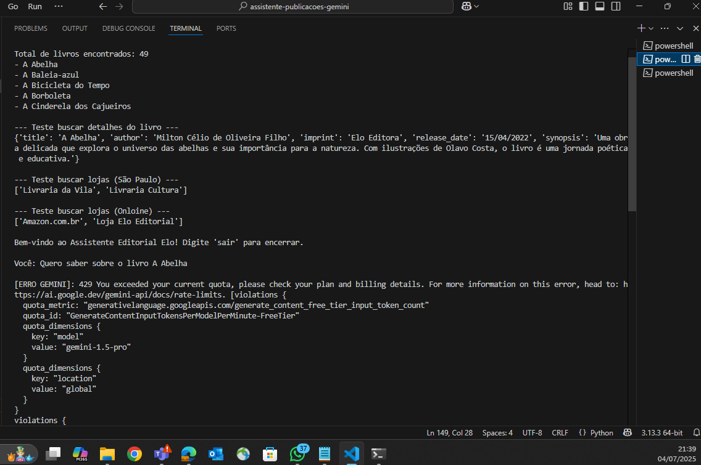
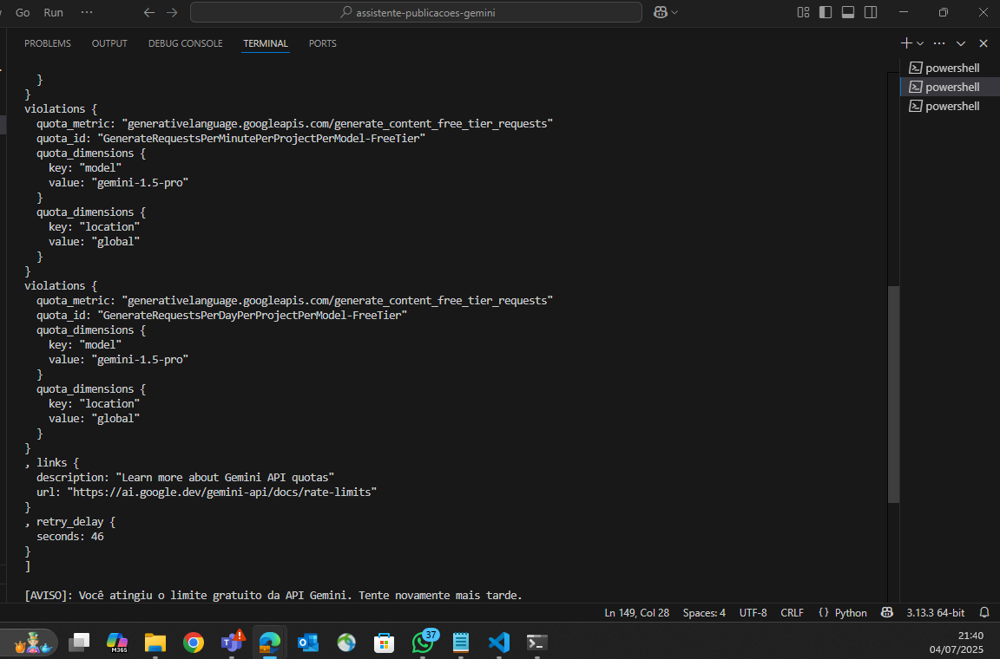

Assistente de Publicações Elo Editorial 📚🤖

## 📑 Sumário

- [Funcionalidades](#funcionalidades)
- [Tecnologias Utilizadas](#tecnologias-utilizadas)
- [Como Rodar o Projeto](#como-rodar-o-projeto)
- [Exemplo de Uso](#exemplo-de-uso)
- [Como funciona por tras dos panos](#como-funciona-por-tras-dos-panos)
- [Estrutura do Projeto](#estrutura-do-projeto)
- [Prints do Projeto](#prints-do-projeto)
- [Exemplo de interação e execução](#exemplo-de-interacao-e-execucao)
- [Dicas Importantes](#dicas-importantes)
- [FAQ](#faq)
- [Autor](#autor)


Este projeto é um chatbot inteligente desenvolvido para o desafio do Grupo Elo Editorial. Ele utiliza a API Gemini do Google, com Function Calling, para fornecer informações sobre livros do catálogo Elo Editora e Perabook – e ajudar leitores a encontrar onde comprar nossos títulos, tanto em lojas físicas quanto online.


## Funcionalidades

Busca inteligente de livros: Data de lançamento, selo editorial, autor e sinopse.

Ajuda a encontrar pontos de venda: Mostra as livrarias físicas por cidade e lojas online.

Memória de contexto: Se você pergunta sobre um livro e depois pergunta "onde encontro?", o bot entende do que você está falando.

Conversação natural: Mantém histórico das interações.


## Tecnologias Utilizadas

Python 3.8+

Google Gemini API (via google-generativeai)

python-dotenv para segurança da chave

Dados em JSON simulando um catálogo real


## Como Rodar o Projeto

Clone o repositório

git clone https://github.com/seu-usuario/assistente-publicacoes-gemini.git

cd assistente-publicacoes-gemini/src

Crie um ambiente virtual (opcional, mas recomendado)

python -m venv venv

Linux/Mac: source venv/bin/activate

Windows: venv\Scripts\activate

Instale as dependências

pip install -r ../requirements.txt

Configure sua chave da API Gemini

Renomeie .env.example para .env

Cole sua chave no formato:

GEMINI_API_KEY=SUA_CHAVE_AQUI

Execute o chat

python main.py


## Exemplo de Uso

Bem-vindo ao Assistente Editorial Elo! Digite 'sair' para encerrar.

Você: Quero saber sobre o livro A Abelha

Assistente: "A Abelha", de Milton Célio de Oliveira Filho, publicado pela Elo Editora em 15/04/2022.

Sinopse: Uma obra delicada que explora o universo das abelhas e sua importância para a natureza...

Você: Onde encontro esse livro em São Paulo?

Assistente: Você pode comprar em: Livraria da Vila, Livraria Cultura.

Você: E online?

Assistente: Online, o livro "A Abelha" está disponível em: Amazon.com.br, Loja Elo Editorial.


## Como funciona por tras dos panos

get_book_details: Busca pelo título e retorna data, autor, sinopse, selo editorial.

find_stores_selling_book: Busca lojas físicas (por cidade) ou online onde o livro está disponível.

O Function Calling da Gemini chama as funções Python certas conforme a conversa.


## Estrutura do Projeto

```text
assistente-publicacoes-gemini/
├── print/
│   ├── projeto-elo-1.png
│   ├── projeto-elo-2.png
├── src/
│   ├── main.py
│   ├── __init__.py
│   └── mock_catalog.json
├── requirements.txt
├── .env.example
└── README.md
```


## Prints do Projeto

## Exemplo de interação e execução






## Dicas Importantes

NUNCA compartilhe sua chave API real (.env). Envie apenas o .env.example sem a chave.

Se atingir o limite gratuito da Gemini, aguarde alguns minutos ou configure um projeto no Google Cloud com billing.

O chat é 100% local, sua chave não será exposta para terceiros.


## FAQ

Preciso de chave de cartão de crédito para rodar?
R: Não, para testes pequenos, o free tier da Gemini já atende.

Posso adaptar para outros catálogos?
R: Sim! Basta trocar o arquivo mock_catalog.json.


## Autor


[](https://www.linkedin.com/in/franc-washington-vilela-12446016a/)  
Franc Washington Vilela  
E-mail: fvilela216@gmail.com


<div align="center"> Feito com 💙 para o desafio do Grupo Elo Editorial. </div>